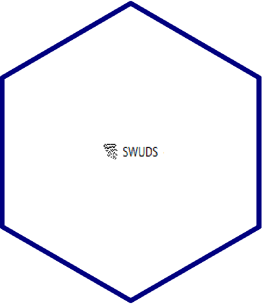

# wateRuseSWUDS 

[](https://travis-ci.org/USGS-R/wateRuse_swuds) [](https://codecov.io/gh/USGS-R/wateRuse_swuds?branch=master)  [](https://owi.usgs.gov/R/packages.html#support)  

## Setup data

```r
pathToSample <- system.file("extdata",package = "wateRuseSWUDS")

# Read in the water quantity table
dq <- readWaterQuantityXL(file.path(pathToSample,"OH_CTF_SW_monthly_permit_sample_data.xlsx"))

# Read in the population served table
dp <- readPopServedXL(file.path(pathToSample,"OHpopserved_output.xlsx"))

# merge the tables
df <- mergeWaterQuantPopServ(waterQuantDF = dq, popServDF = dp)

#melt the table
df_melt <- meltWaterQuantPopServ(mergeWaterQuantPopServ = df)
```

## Pull requests


- Please run `lintr::lint_package()` before submitting a pull request.  
- consider running `goodpractice::gp()` on the package before contributing.


## Disclaimer

This software is preliminary or provisional and is subject to revision. It is being provided to meet the need for timely best science. The software has not received final approval by the U.S. Geological Survey (USGS). No warranty, expressed or implied, is made by the USGS or the U.S. Government as to the functionality of the software and related material nor shall the fact of release constitute any such warranty. The software is provided on the condition that neither the USGS nor the U.S. Government shall be held liable for any damages resulting from the authorized or unauthorized use of the software.
